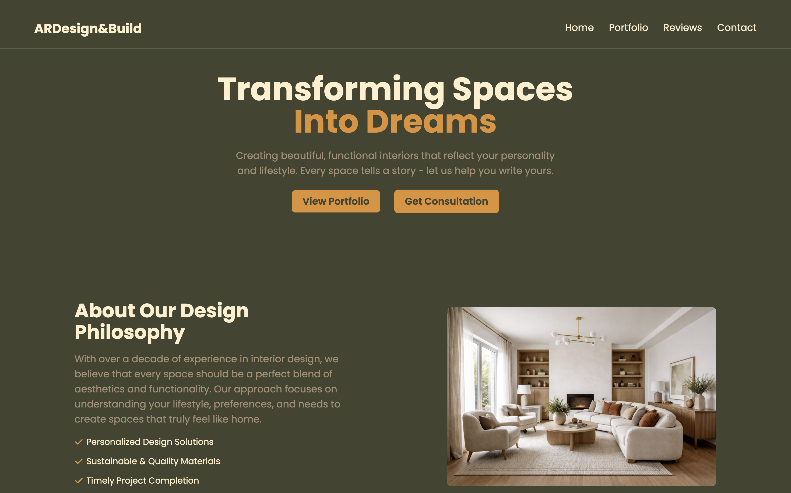
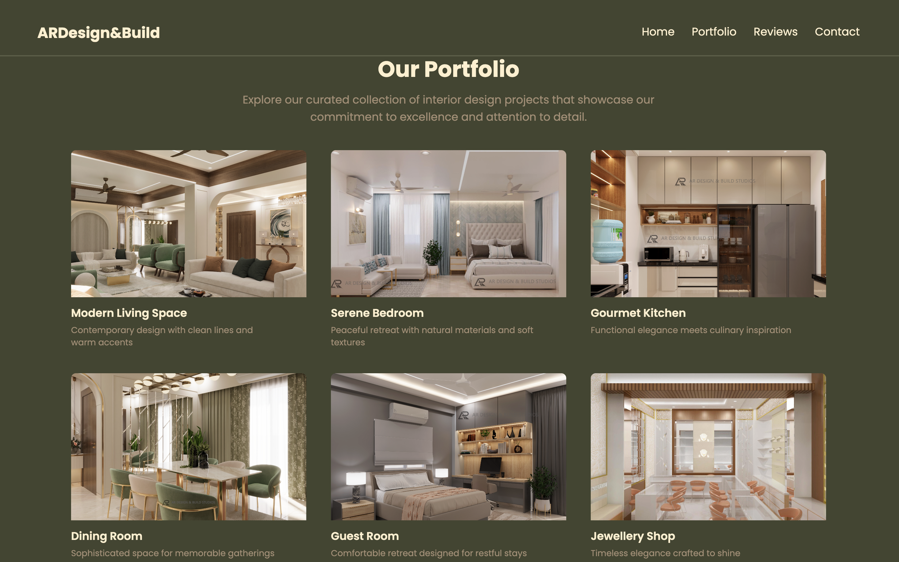
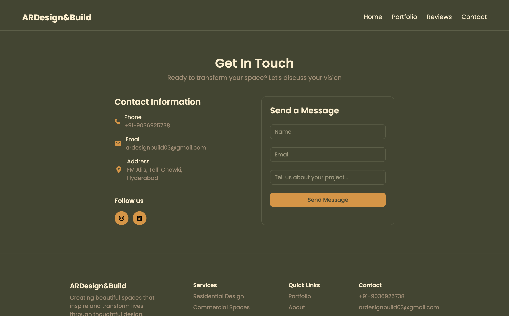

# 📐 ARDesign&Build


---

**ARDesign&Build** is a premium, responsive freelance website developed for an interior design & construction brand.  
The project focuses on visual storytelling, clean layouts, and smooth user interactions to present design work in an elegant and modern way.

This website is part of my freelance portfolio and represents real-world frontend development for design-oriented businesses.

---

## ✨ Features

- Premium landing page layout  
- Portfolio grid with hover animations  
- Smooth transitions and micro-interactions  
- Fully responsive across all devices  
- Contact section with direct email integration  
- Custom color palette and typography  

---

## 🛠 Tech Stack

- **React (Vite)** – Fast development and build  
- **Tailwind CSS** – Utility-first styling  
- **HTML5 & Modern CSS**  
- **Google Fonts (Poppins)**  

---

## 🎯 Project Goals

- Showcase interior design projects in a professional layout  
- Build a strong digital presence for a design & build studio  
- Deliver a fast, responsive, and visually refined UI  
- Follow real-world freelance workflow and structure  

---

## 📁 Project Structure

```
src/
├─ assets/ # Images, logos
├─ components/ # Header, Sections, Footer
├─ pages/ # Home, Portfolio, Contact
└─ main.jsx
```

---

## 🖼 Screenshots

> Add your website screenshots in a `screenshots` folder and update the paths below.

### Home Page


### Portfolio Section


### Contact Section


---

## 🚀 Getting Started

Install dependencies:

```bash
npm install
npm run dev
```

## 👨‍💻 Author

**Arza Mansoori**  
Frontend Developer | Freelance Web Developer  

- React • Tailwind CSS • UI Development  
- Passion for clean UI, modern design, and smooth user experience  

